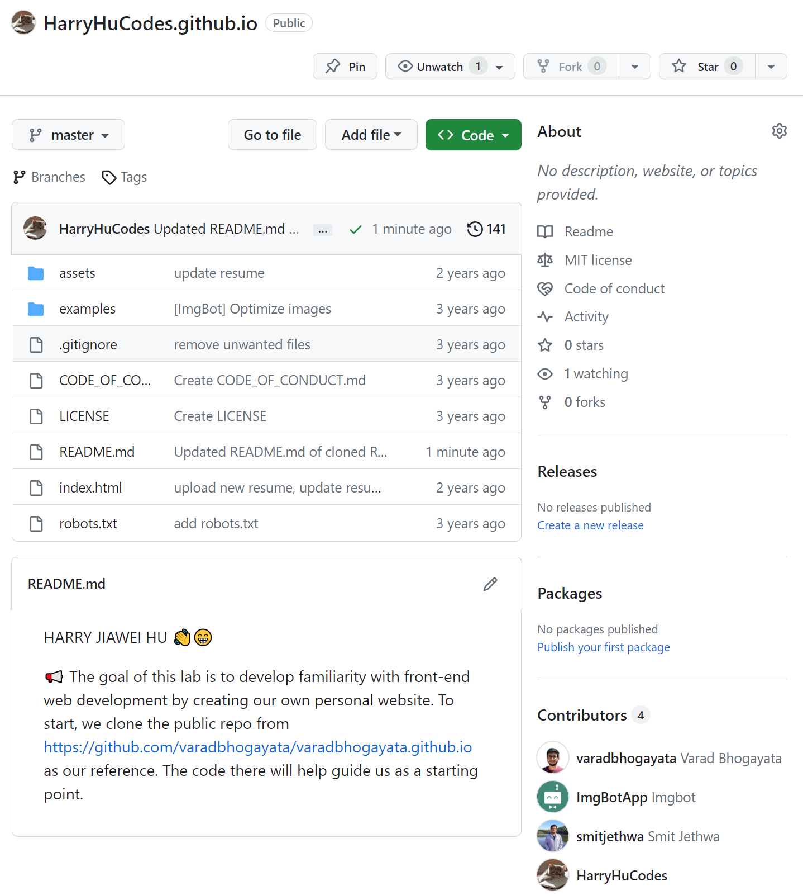
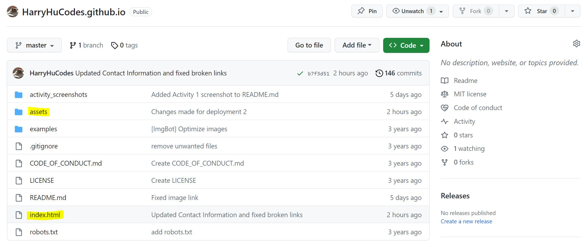

HARRY JIAWEI HU 👋😁

📢 The goal of this lab is to develop familiarity with front-end web development by creating our own personal website. To start, we clone the public repo from https://github.com/varadbhogayata/varadbhogayata.github.io as our reference. The code there will help guide us as a starting point.

Activity 1 (Cloning Website Repo onto Personal Github Account)

Screenshot showing the completion of activity 1 - pushed cloned repo code into our empty repo and updating README.md to include our name & citation of source code. 

Activity 2 (Adding personal information - experiences, projects, education, skills, contact and resume)

Screenshot of repo containing updated personal information (under 'changes made for deployment' commits) after the successful deployment of website using Github pages.
 
 Homepage of deployed site